# Тема 1.
Отчет по Теме #1 выполнила:
- Ноговицина Ирина Андреевна
- ИВТ-22-2

| Задание | Лаб_раб |
| ------ | ------ | 
| Задание 1 | + |
| Задание 2 | + |
| Задание 3 | + |
| Задание 4 | + |
| Задание 5 | + |
| Задание 6 | + |
| Задание 7 | + |
| Задание 8 | + |
| Задание 9 | + |
| Задание 10 | + |
| Задание 11 | + |
| Задание 12 | + |
| Задание 13 | + | 
| Задание 14 | + |
| Задание 15 | + |

знак "+" - задание выполнено; знак "-" - задание не выполнено;

Работу проверили:
- к.э.н., доцент Панов М.А.

## Лабораторная работа №1
### 2.1 Устанока

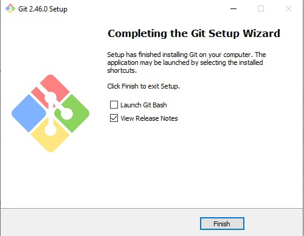

## Выводы
Было установлено программное обеспечение Git.

### 2.2 Настройка

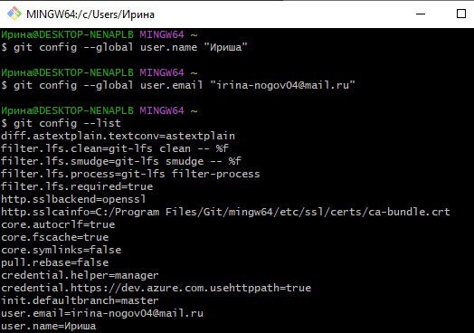

## Выводы
Было настроено программное обеспечение Git.

### 2.3 Создание нового репозитория

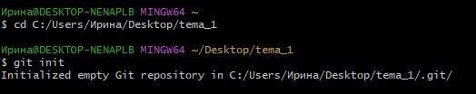

## Выводы
Был инициализирован репозиторий.

###  2.4 Подготовка файлов 

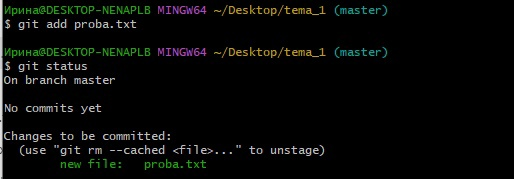

## Выводы
Был добавлен файл и коммит.

### 2.5 фиксация изменений

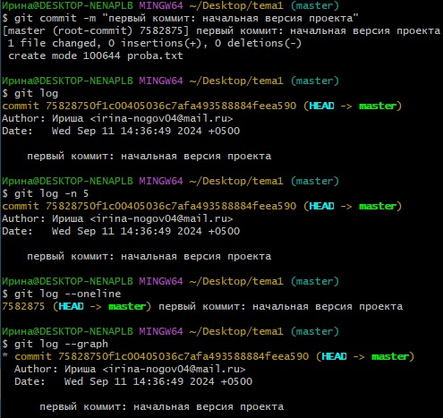

## Выводы
Были зафиксированы изменения.

### 2.6 Подключение к удаленному репозиторию 
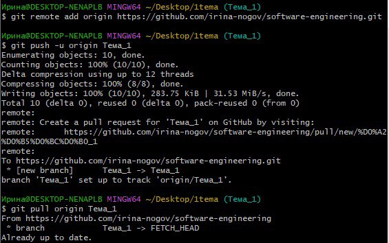

## Выводы
Подключение к удалённому репозиторию на GitHub и передача файлов и коммитов.

### Пункт 2.7 Ветвление

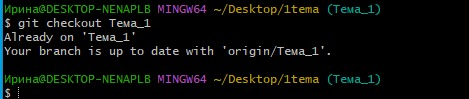

## Выводы
Была создана и добавлена новая ветвь.

### Пункт 2.8 Особенности применения «Фетч»

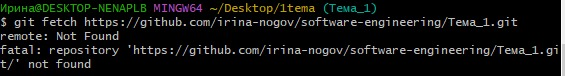

## Выводы
Была использована комманда "fetch".

### Пункт 2.9 Удаление файлов, веток, локальных и удалённых репозиториев

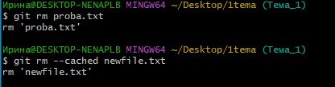

## Выводы
Был удален файл proba.txt.

### Пункт 2.10 Отслеживание изменений в коммитах

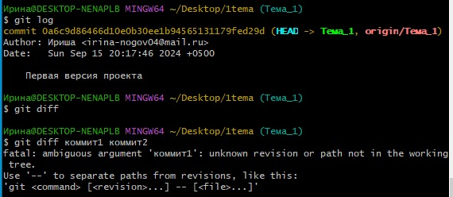

## Выводы
Были сравнены хэши двух разных коммитов.

### Пункт 2.11 Возвращение файла к предыдущему (определенному) состоянию

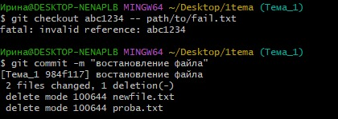

## Выводы
Файл был возвращён к предыдущему состоянию.

### Пункт 2.12. Возвращение к предыдущему коммиту

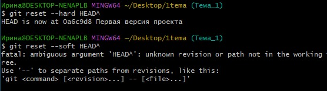

## Выводы
Возвращение к предыдущему коммиту удалило файлы, т.к. этот коммит был пустой (без файлов).

### Пункт 2.13 Исправление коммита

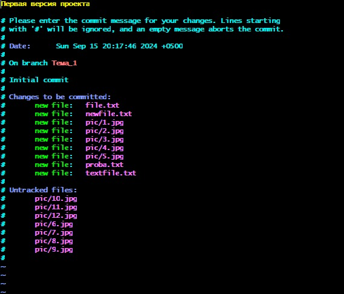

## Выводы
Был исправлен коммит через --amend.

### Пункт 2.14 Разрешение конфликтов при слиянии

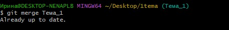

## Выводы
Были разрешены конфликты при слиянии.

### Пункт 2.15 Настройка. gitignore

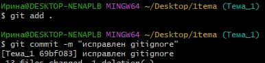

## Выводы
Был создан файл .gitignore, который исключает определенные файлы и директории из репозитория.

## Общие выводы по теме
В Теме 1 мы научились работать с репозиториями на GitHub и git.
