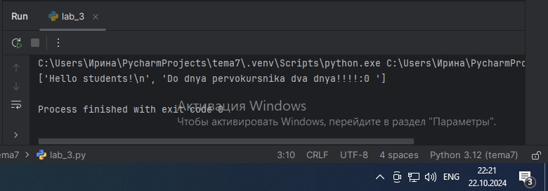
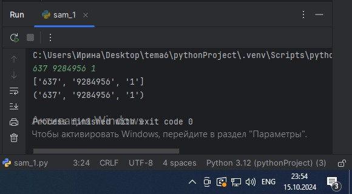

# Тема 6.
Отчет по Теме № 6 выполнила:
- Ноговицина Ирина Андреевна
- ИВТ-22-2

| Задание | Лаб_раб | Сам_раб |
| --- | --- | --- |
| Задание 1 | + | + |
| Задание 2 | + | + |
| Задание 3 | + | + |
| Задание 4 | + | + |
| Задание 5 | + | + |

знак "+" - задание выполнено; знак "-" - задание не выполнено;

Работу проверили:
- к.э.н., доцент Панов М.А.


# Лабораторная работа № 6
## Задание № 1.
В школе, где вы учились, узнали, что вы крутой программист и попросили написать программу для учителей, которая будет при вводе кабинета писать для него ключ доступа и статус, занят кабинет или нет. При написании программы необходимо использовать словарь (dict), который на вход получает номер кабинета, а выводит необходимую информацию. Если кабинета, который вы ввели нет в словаре, то в консоль в виде значения ключа нужно вывести “None” и виде статуса вывести “False”.

По большому счету написав данную программу мы с вами научились заменять иногда громоздкую конструкцию if/elif/else. Поскольку здесь функционал словаря полностью повторяет функционал условия, но при этом у использования словарей в более сложных программах есть намного больше возможностей реализации.

```python
request = int(input('Введите номер кабинета: '))

dictionary = {
    101: {'key': 1234, 'access': True},
    102: {'key': 1337, 'access': True},
    103: {'key': 8943, 'access': True},
    104: {'key': 5555, 'access': False},
    None: {'key': None, 'access': False},
}

response = dictionary.get(request)
if not response:
    response = dictionary[None]
key = response.get('key')
access = response.get('access')
print(key,access)
```

### Результат.


### Выводы.
Данный код выводит ключ доступа и статус кабинета, с помощью словаря.

## Задание № 2.
Алексей решил создать самый большой словарь в мире. Для этого он придумал функцию dict_maker (**kwargs), которая принимает неограниченное количество параметров «ключ: значение» и обновляет созданный им словарь my_dict, состоящий всего из одного элемента «first» со значением «so easy». Помогите Алексею создать данную функцию.

```python
from pprint import pprint

my_dict = {'first': 'so easy'}

def dict_maker(**kwargs):
    my_dict.update(**kwargs)

dict_maker(a1=1,a2=20,a3=54,a4=13)
dict_maker(name='Михаил',age=31,weight=70,eyes_color='blue')
pprint(my_dict)
```

### Результат.


### Выводы.
Код создаёт словари. В нём мы использовали встроенный модуль pprint, который выводит большие объемы информации более понятно для восприятия человеческим глазом. 

## Задание № 3.
Для решения некоторых задач бывает необходимо разложить строку на отдельные символы. Мы знаем что это можно сделать при помощи split(), у которого более гибкая настройка для разделения для этого, но если нам нужно посимвольно разделить строку без всяких условий, то для этого мы можем использовать кортежи (tuple). Для этого напишем любую строку, которую будем делить и “обвернем” ее в tuple и дальше мы можем как нам угодно с ней работать, например, сделать ее списком (тогда получится полный аналог split()) или же работать с ним дальше, как с кортежем.

```python
input_string = 'HelloWorld'
result = tuple(input_string)
print(result)
print(list(result))
```

### Результат.


### Выводы.
Данный код создаёт кортеж из строки.

## Задание № 4
Вовочка решил написать крутую функцию, которая будет писать имя, возраст и место работы, но при этом на вход этой функции будет поступать кортеж. Помогите Вовочке написать эту программу.

```python
def personal_info(name,age,company='unnamed'):
    print(f"Имя: {name} Возраст: {age} Компания: {company}")

tom = ('Григорий',22)
personal_info(*tom)


bob = ('Георгий',41,'Yandex')
personal_info(*bob)
```

### Результат.


### Выводы.
Данный код выводит информацию о имени, возрасте и месте работы, получаемую из кортежа.

## Задание № 5.
Для сопровождения первых лиц государства X нужен кортеж, но никто не может определиться с порядком машин, поэтому вам нужно написать функцию, которая будет сортировать кортеж, состоящий из целых чисел по возрастанию, и возвращает его. Если хотя бы один элемент не является целым числом, то функция возвращает исходный кортеж.

```python
def tuple_sort(tpl):
    for elm in tpl:
        if not isinstance(elm, int):
            return tpl
    return tuple(sorted(tpl))

if __name__ == '__main__':
    print(tuple_sort((5,5,3,1,9)))
    print(tuple_sort((5,3,2.1,'1',9)))
```

### Результат.


### Выводы.
Данный код сортирует кортеж, состоящий из целых чисел по возрастанию, и возвращает его.

# Самостоятельная работа № 6.
## Задание № 1.
При создании сайта у вас возникла потребность обрабатывать данные пользователя в странной форме, а потом переводить их в нужные вам форматы. Вы хотите принимать от пользователя последовательность чисел, разделенных пробелом, а после переформатировать эти данные в список и кортеж. Реализуйте вашу задумку. Для получения начальных данных используйте input(). Результатом программы будет выведенный список и кортеж из начальных данных.

```python
a = input()
print(list(a.split()))
print(tuple(a.split()))
```

### Результат.


### Выводы.
Данный код выводит список и кортеж в требуемом формате.

## Задание № 2. 
Николай знает, что кортежи являются неизменяемыми, но он очень упрямый и всегда хочет доказать, что он прав. Студент решил создать функцию, которая будет удалять первое появление определенного элемента из кортежа по значению и возвращать кортеж без него. Попробуйте повторить шедевр не признающего авторитеты начинающего программиста. Но учтите, что Николай не всегда уверен в наличии элемента в кортеже (в этом случае кортеж вернется функцией в исходном виде).

Входные данные:
- (1, 2, 3), 1) 
- (1, 2, 3, 1, 2, 3, 4, 5, 2, 3, 4, 2, 4, 2), 3) 
- (2, 4, 6, 6, 4, 2), 9)

Ожидаемый результат:
- (2,3)
- (1, 2, 1, 2, 3, 4, 5, 2, 3, 4, 2, 4, 2)
- (2, 4, 6, 6, 4, 2)

```python
def dele(kor, a):
    if a in kor:
        aInd = kor.index(a)
        return kor[:aInd] + kor[aInd + 1:]
    return kor

print(dele((1, 2, 3), 1))
print(dele((1, 2, 3, 1, 2, 3, 4, 5, 2, 3, 4, 2, 4, 2), 3))
print(dele((2, 4, 6, 6, 4, 2), 9))
```

### Результат.


### Выводы.
Данный код удаляет первый заданный элемент из кортежа.

## Задание № 3.
Ребята поспорили кто из них одним нажатием на numpad наберет больше повторяющихся цифр, но не понимают, как узнать победителя. Вам им нужно в этом помочь. Дана строка в виде случайной последовательности чисел от 0 до 9 (длина строки минимум 15 символов). Требуется создать словарь, который в качестве ключей будет принимать данные числа (т. е. ключи будут типом int), а в качестве значений – количество этих чисел в имеющейся последовательности. Для построения словаря создайте функцию, принимающую строку из цифр. Функция должна возвратить словарь из 3-х самых часто встречаемых чисел, также эти значения нужно вывести в порядке возрастания ключа.

```python
def countOften(num):
   numCount = {}
   for i in num:
       numCount[i] = numCount.get(i, 0) + 1
   oftenCommon = sorted(numcount.items(), key=lambda x: x[1], reverse=True)[:3]
   result = {key: value for key, value in sorted(most_common)}
   return result
str=input()
print(countOften(str))

def mostNum(num):
    return max(set(num), key=num.count)
res = tuple(str)
print(mostNum(list(res)))
```

### Результат.


### Выводы.
Данный код выводит три самые часто встречающиеся числа.

## Задание № 4.
Ваш хороший друг владеет офисом со входом по электронным картам, ему нужно чтобы вы написали программу, которая показывала в каком порядке сотрудники входили и выходили из офиса. Определение сотрудника происходит по id. Напишите функцию, которая на вход принимает кортеж и случайный элемент (id), его можно придумать самостоятельно. Требуется вернуть новый кортеж, начинающийся с первого появления элемента в нем и заканчивающийся вторым его появлением включительно. Если элемента нет вовсе – вернуть пустой кортеж. Если элемент встречается только один раз, то вернуть кортеж, который начинается с него и идет до конца исходного.

Входные данные:
- (1, 2, 3), 8) 
- (1, 8, 3, 4, 8, 8, 9, 2), 8) 
- (1, 2, 8, 5, 1, 2, 9), 8)

Ожидаемый результат:
- ()
- (8, 3, 4, 8)
- (8, 5, 1, 2, 9)

```python
def passT(inpTuple: tuple, passId: int) -> tuple:
   startIndex = -1
   finishIndex = len(inpTuple)
   k = 0

   for i in range(len(inpTuple)):
       if passId == inpTuple[i]:
           startIndex = i
           k += 1
           break
   if k != 0:
       for i in range(startIndex + 1, len(inpTuple)):
           if passId == inpTuple[i]:
               finishIndex = i + 1
               break

   if startIndex != -1:
       return inpTuple[startIndex:finishIndex]
   else:
       return ()
print(passT((1, 2, 3), 8))
print(passT((1, 8, 3, 4, 8, 8, 9, 2), 8))
print(passT((1, 2, 8, 5, 1, 2, 9), 8))
```

### Результат.


### Выводы.
Данный код возвращает кортеж, начинающийся с первого появления элемента в нем и заканчивающийся вторым его появлением включительно.

## Задание № 5.
Самостоятельно придумайте и решите задачу, в которой будут обязательно использоваться кортеж или список. Проведите минимум три теста для проверки работоспособности вашей задачи.

Придуманная задача: посчитать сумму чисел в списке и проверить, больше ли она заданного числа.

Входные данные:
- (1, 2, 3, 4, 5), 7)
- (2, 4, 3), 13)
- (9, 6, 2, 8, 5, 5, 3, 11), 46)

Ожидаемый результат:
- True
- False
- True

```python
# Задание 5
def sumBol(num, bol):
    sumN = sum(num)
    return sumN > bol

print(sumBol((1, 2, 3, 4, 5), 7))
print(sumBol((2, 4, 3), 13))
print(sumBol((9, 6, 2, 8, 5, 5, 3, 11), 46))
```

### Результат.


### Выводы.
В данном коде функция sumBol ссумирует числа списка и сравнивает сумму с заданным числом.

## Общий вывод по теме.
В данной теме мы изучили словари и кортежи.
