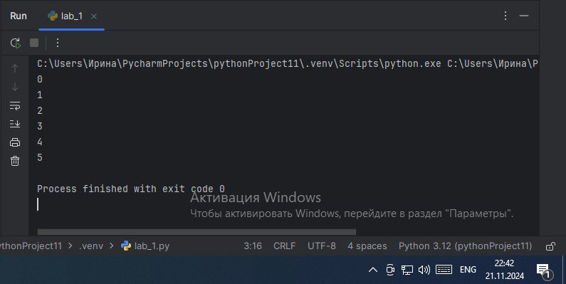
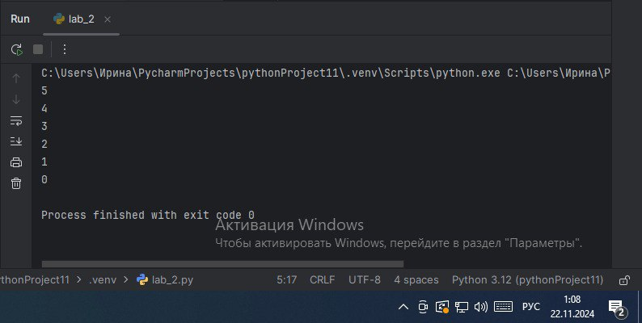
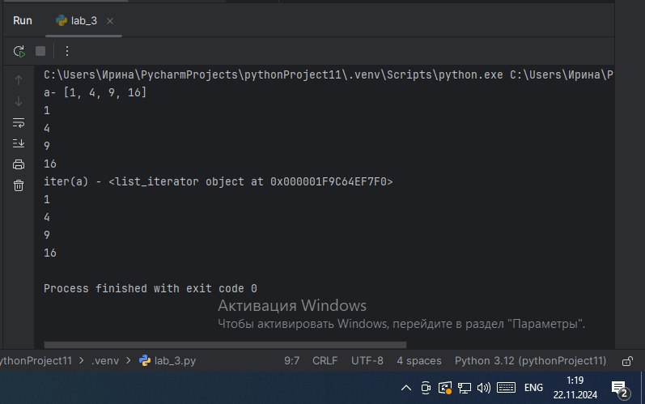
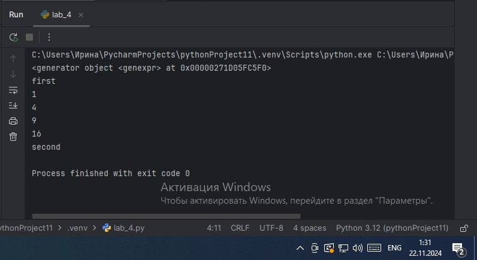
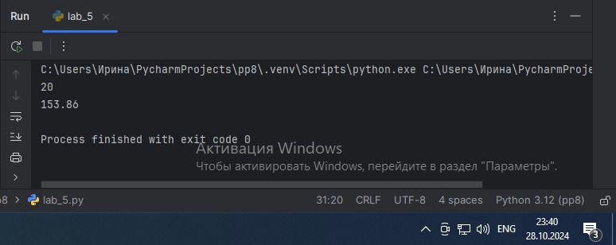
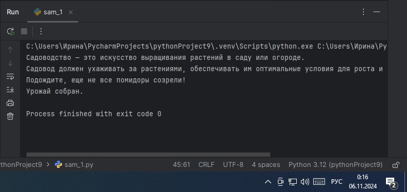

# Тема 9.
Отчет по Теме № 9 выполнила:
- Ноговицина Ирина Андреевна
- ИВТ-22-2

| Задание | Лаб_раб | Сам_раб |
| --- | --- | --- |
| Задание 1 | + | + |
| Задание 2 | + | + |
| Задание 3 | + | + |
| Задание 4 | + | + |
| Задание 5 | + | + |
| Задание 6 |  | + |
| Задание 7 |  | + |
| Задание 8 |  | + |
| Задание 9 |  | + |
| Задание 10 |  | + |

знак "+" - задание выполнено; знак "-" - задание не выполнено;

Работу проверили:
- к.э.н., доцент Панов М.А.

# Лабораторная работа № 9
## Задание № 1. Допустим, что вы решили оригинально и немного странно познакомиться с человеком. Для этого у вас должен быть написан свой класс на Python, который будет проверять угадал ваше имя человек или нет. Для этого создайте класс, указав в свойствах только имя. Дальше создайте функцию init(), а в ней сделайте проверку на то угадал человек ваше имя или нет. Также можете проверить что будет, если в этой функции указав атрибут, который не указан в вашем классе, например, попробуйте вызвать фамилию.

```python
class Irina:
    slots = ["name"]

    def __init__(self, name):
        if name == 'Ирина':
            self.name = f"Да, я {name}"
        else:
            self.name =f"Я не {name}, а Ирина"

person1 = Irina('Мария')
person2 = Irina('Ирина')
print(person1.name)
print(person2.name)

person2.surname='Ноговицина'
```

### Результат.


### Выводы.
Данный код проверяет угадал мое имя человек или нет.

## Задание № 2.  Вам дали важное задание, написать продавцу мороженого программу, которая будет писать добавили ли топпинг в мороженое и цену после возможного изменения. Для этого вам нужно написать класс, в котором будет определяться изменили ли состав мороженого или нет. В этом классе реализуйте метод, выводящий на печать "Мороженое с {ТОППИНГ}" в случае наличия добавки, а иначе отобразиться следующая фраза: "Обычное мороженое". При этом программа должна воспринимать как топпинг только атрибуты типа string.

```python
class Icecream:
    def __init__(self, ingredient = None):
        if isinstance(ingredient,str):
            self.ingredient = ingredient
        else:
            self.ingredient = None

    def composition(self):
        if self.ingredient:
            print(f"Мороженое с {self.ingredient}")
        else:
            print('Обычное мороженое')

icecream = Icecream()
icecream.composition()
icecream = Icecream('шоколадом')
icecream.composition()
icecream = Icecream(5)
icecream.composition()
```

### Результат.


### Вывод.
Данный код пишет добавили ли топпинг в мороженое и цену после возможного изменения.

## Задание № 3. Петя - начинающий программист и на занятиях ему сказали реализовать икапсу.. что-то. А вы хороший друг Пети и ко всему прочему прекрасно знаете, что икапсу.. что-то - это инкапсуляция, поэтому решаете помочь вашему другу с написанием класса с инкапсуляцией. Ваш класс будет не просто инкапсуляцией, а классом с сеттером, геттером и деструктором. После написания класса вам необходимо продемонстрировать что все написанные вами функции работают. Также вам необхходимо объяснить Пете почему на скриншоте ниже в консоли выводится ошибка.

```python
class MyClass:
    def __init__(self, value):
        self._value = value

    def set_value(self, value):
        self._value = value

    def get_value(self):
        return self._value

    def del_value(self):
        del self._value

    value = property(get_value, set_value, del_value, "Свойства value")

obj = MyClass(42)
print(obj.get_value())
obj.set_value(45)
print(obj.get_value())
obj.set_value(100)
print(obj.get_value())
obj.del_value()
print(obj.get_value())
```

### Результат.


### Выводы.
Ошибка возникает из-за того, что когда мы удаляем атрибут, мы не можем его получить.

## Задание № 4. Вам прекрасно известно, что кошки и собаки являются млекопитающими, но компьютер этого не понимает, поэтому вам нужно написать три класса: Кошки, Собаки, Млекопитающие. И при помощи "наследования" объяснить компьютеру что кошки и собаки - это млекопитающие. Также добавьте какой-нибудь свой атрибут для кошек и собак, чтобы показать, что они чем-то отличаются друг от друга.

```python
class Mammal:
    className = 'Mammal'

class Dog(Mammal):
    species = 'canine'
    sounds = 'wow'
    def behavior(self):
        return "Dogs are known for their loyalty and obedience"

class Cat(Mammal):
    species = 'feline'
    sounds = 'meow'
    def behavior(self):
        return "Cats are known for their independence and agility"

dog = Dog()
print(f"Dog is {dog.className}, but they say {dog.sounds}. {dog.behavior()}")
cat = Cat()
print(f"Cat is {cat.className}, but they say {cat.sounds}. {cat.behavior()}")
```

### Результат.


### Выводы.
Данный код объясняет компьютеру, что кошки и собаки являются млекопитающими и чем они отличаются.

## Задание № 5.На разных языках здороваются по-разному, но суть остается одинаковой, люди друг с другом здороваются. Давайте вместе с вами реализуем программу с полиморфизмом, которая будет описывать всю суть первого предложения задачи. Для этого мы можем выбрать два языка, например, русский и английский и написать для них отдельные классы, в которых будет в виде атрибута слово, которым здороваются на этих языках. А также напишем функцию, которая будет выводить информацию о том, как на этих языках здороваются.

```python
class Russian:
    @staticmethod
    def greeting():
        print('Привет')

class English:
    @staticmethod
    def greeting():
        print('Hello')

def greet(language):
    language.greeting()

ivan = Russian()
greet(ivan)
jonh = English()
greet(jonh)
```

### Результат.


### Выводы.
Данная программа с полиморфизмом, показывает как люди здороваются на разных языках.

# Самостоятельная работа № 9.
## Задание № 1.  Садовник и помидоры.
Классовая структура:
Есть помидор со следующими характеристиками:
- Индекс
- Стадия созревания(стадии: отсутствует, цветение, зеленый, красный)
Помидор может:
- Расти(переходить на следующую стадию созревания)
- Предоставлять информацию о своей зрелости
Есть куст с помидорами, который:
- Содержит список томатов, которые на нем растут

А также может:
- Расти вместе с томатами
- Предоставлять информацию о зрелости всех томатов
- Предоставлять урожай

И также есть Садовник, которые имеет:
- Имя
- Растение, за которым он ухаживает

Он может:
- Ухаживать за растением
- Собирать с него урожай

Задание:
Класс Tomato:
1)Создайте класс Tomato
2) Создайте статическое свойства states, которое будет содержать все стадии созревания помидора
3) Создайте метод init(), внутри которого будут определены два динамических свойства: _index(передается параметром) и _state (принимает первое значение из словаря states). После написания этого блока кода в комментарии к нему укажите какими являются эти два свойства
4) Создайте метод grow(), который будет переводить томат на следующую стадию созревания
5) Создайте метод is_ripe(), который будет проверять , что томат созрел

Класс TomatoBush:
1) Создайте класс TomatoBush
2) Определите метод init(), который будет принимать в качестве параметра количество томатов и на его основе будет создавать список объектов класса Tomato. Данный список будет храниться внутри динамического свойства tomatoes
3) Создавайте метод grow_all(), который будет переводить все объекты из списка томатов на следующий этам созревания
4) Создайте метод all_are_ripe(), который будет возвращать True, если все томаты из списка стали спелыми
5) Создайте метод grive_away_all(), который будет чистить список томатов после сбора урожая

Класс Gardener:
1) Создайте класс Gardener
2) Создайте метод init(), внутри которого будут определены два динамических свойства: name ( передается параметром, является публичным) и _plant (принимает объект класса TomatoBush). После написания этого блока кода в комментарии к нему укажите какими являются эти два свойства.
3) Создайте метод work(), который заставляет садовника работать, что позволяет растению становиться более зрелым
4) Создайте метод harvest(), который проверяет, все ли плоды созрели. Если все, то садовник собирает урожай. Если нет, то метод печатает предупреждение
5) Создайте статический метод knowledge_base(), который выведет в консоль справку по садоводству

Тесты:
1) Вызовите справку по садоводству
2) Создайте объекты классов TomatoBush и Gardener
3) Используй объект класса Gardener, поухаживайте за кустом с помидорами
4) Попробуйте собрать урожай, когда томаты еще не дозрели. Продолжайте ухаживать за ними
5) Соберите урожай

```python
class Tomato:
    states = {'Отсутствует': 0, 'Цветение': 1, 'Зеленый': 2, 'Красный': 3}
    def __init__(self, index):
        self._index = index
        self._state = self.states['Отсутствует']

    def grow(self):
        if self._state < 3:
            self._state += 1

    def is_ripe(self):
        return True if self._state == 3 else False


class TomatoBush:

    def __init__(self, num):
        self.tomatoes = [Tomato(index) for index in range(1, num + 1)]

    def grow_all(self):
        for tomato in self.tomatoes:
            tomato.grow()

    def all_are_ripe(self):
        return all([tomato.is_ripe() for tomato in self.tomatoes])

    def give_away_all(self):
        self.tomatoes = []


class Gardener:

    def __init__(self, name, plant):
        self.name = name
        self._plant = plant

    def work(self):
        self._plant.grow_all()

    def harvest(self):
        if self._plant.all_are_ripe():
            print('Урожай собран.')
            self._plant.give_away_all()
        else:
            print("Подождите, еще не все помидоры созрели!")

    @staticmethod
    def knowledge_base():
        print("Садоводство — это искусство выращивания растений в саду или огороде.")
        print("Садовод должен ухаживать за растениями, обеспечивать им оптимальные условия для роста и созревания.")


#Тесты.
#1.Вызов справки по садоводству
Gardener.knowledge_base()
#2.Создание объектов классов TomatoBush и Gardener
bush = TomatoBush(5)
gardener = Gardener('Ирина', bush)
#3. Уход за кустом
gardener.work()
#4. Сбор не спелого урожая и продолжение ухода
gardener.harvest()
gardener.work()
gardener.work()
#5. Сбор спелого урожая
gardener.harvest()
```

### Результат.


### Выводы.
В данном коде реализована задача Садовник и помидоры. Все тесты проведены успешно.

## Общий вывод по теме.
В данной теме мы изучили концепции и принципы ООП.
