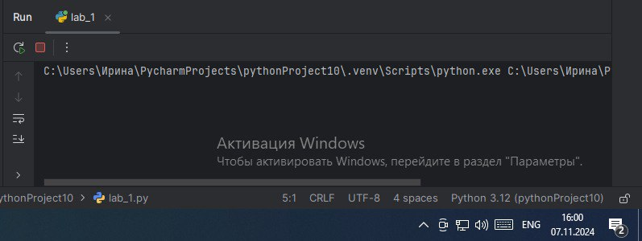
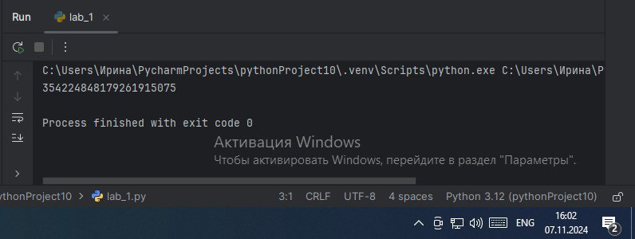
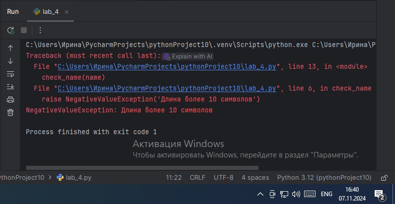
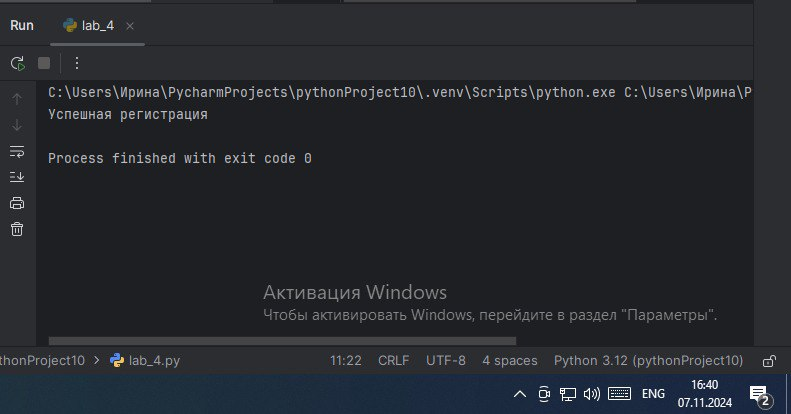
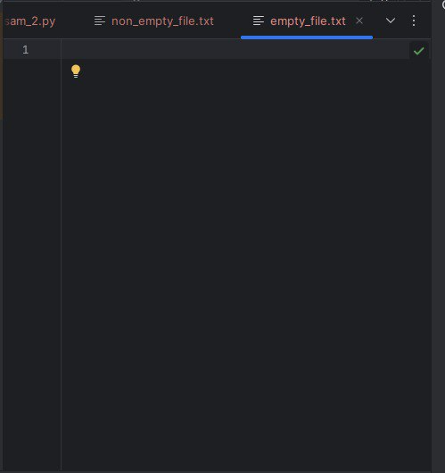
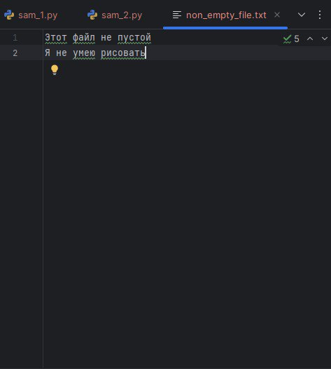
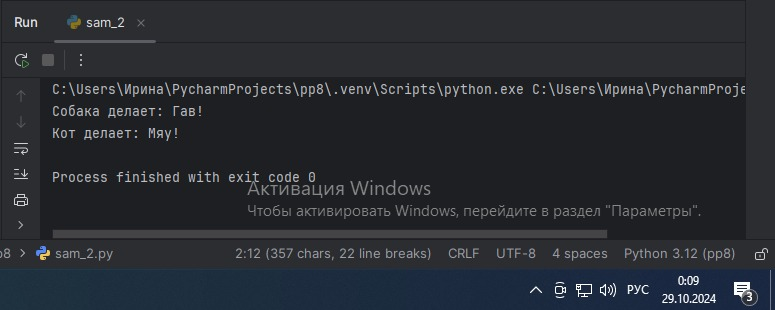
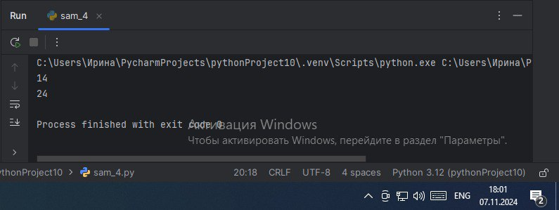
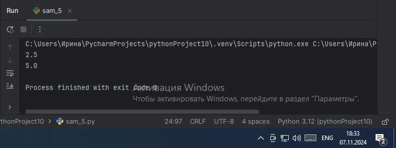

# Тема 10.
Отчет по Теме № 10 выполнила:
- Ноговицина Ирина Андреевна
- ИВТ-22-2

| Задание | Лаб_раб | Сам_раб |
| --- | --- | --- |
| Задание 1 | + | + |
| Задание 2 | + | + |
| Задание 3 | + | + |
| Задание 4 | + | + |
| Задание 5 | + | + |

знак "+" - задание выполнено; знак "-" - задание не выполнено;

Работу проверили:
- к.э.н., доцент Панов М.А.


# Лабораторная работа № 10
## Задание № 1.Вам нужно написать программу, которая будет считать числа Фибоначчи для 100 и запустить ее без этого декоратора и с ним, посмотреть на разницу во времени решения поставленной задачи.

```python
from functools import lru_cache

@lru_cache(None)
def fiboonacci(n):
    if n ==0:
        return 0
    elif n == 1:
        return 1
    return fiboonacci(n-1) + fiboonacci(n-2)

if __name__ == '__main__':
    print(fiboonacci(100))
```

### Результат.
- Без декоратора.

- С декоратором.


### Вывод.
При тесте данного кода без дкоратора я подождала 10 секунд и результата не дождалась, а с декоратором очень быстро вывелся результат.

## Задание № 2. Илья пишет свой сайт и ему необходимо сделать минимальную проверку ввода данных пользователя при регистрации. Для этого он реализовал функцию, которая выводит данные пользователя на экран и решил, что  будет проверять правильность выведенных данных при помощи декоратора, но в этом ему потребовалась ваша помощь. Напишите декоратор для функции, который будет принимать все параметры вызываемой функции(имя, возраст) и проверять чтобы возраст был больше 0 и меньше 130. Причем заметьте, что неважно сколько пользователь введет данных на сайт к Илье, будут обрабатываться только первые 2 аргумента.

```python
def check(input_func):
    def output_func(*args):
        name, age = args[0], args[1]

        if age < 0 or age > 130:
            age = 'Недопустимый возраст'
        input_func(name, age)

    return output_func

@check
def personal_info(name,age):
    print(f"Name:{name}  Age:{age}")

if __name__ == '__main__':
    personal_info('Владимир', 38)
    personal_info('Александр', -5)
    personal_info('Петр', 138,15,48,2)
```

### Результат.


### Вывод.
Данный код принимает все параметры вызываемой функции(имя, возраст и проверяет, чтобы возраст был больше 0 и меньше 130) и выводит данные при помощи декоратора.

## Задание № 3. Вам понравилась идея Ильи с сайтом, и вы решили дальше работать вместе с ним. Но вот в вашем проекте появилась проблема, кто-то пытается сломать вашу функцию с получением данных для сайта. Эта функция работает только с данными integer, а какой-то недохакер пытается все сломать и вместо нужного типа данных отправляет string. Воспользуйтесь исключениями, чтобы неподходящий тип данных не ломал ваш сайт. Также дополнительно можете обернуть весь код функции в try/except/finally для того, чтобы программа вас оповестила о том, что выявлена какая-то ошибка или программа успешно выполнена.

```python
def data(*args):
    try:
        for i in range(len(*args)):
            try:
                result = (args[0][i] *15)//10
                print(result)
            except Exception as ex:
                print(ex)
    except Exception as ex:
        print(ex)
    finally:
        print('Вся информация обработана')

if __name__ == '__main__':
    data([1,15, 'Hello', 'i', 'try', 'to', 'crash', 'your','site', 38, 45])
```

### Результат.


### Выводы.
Данный код использует исключения, чтобы неподходящий тип данных не ломал наш сайт.

## Задание № 4. Продолжая работу над сайтом, вы решили написать собственное исключение, которое будет вызываться в случае, если в функцию проверки имени при регистрации передана строка длиннее десяти символов, а если имя имеет допустимую длину, то в консоль выводиться "Успешная регистрация".

```python
class NegativeValueException(Exception):
    pass

def check_name(name):
    if len(name)>10:
        raise NegativeValueException('Длина более 10 символов')
    else:
        print('Успешная регистрация')

if __name__ == '__main__':
    name = '12345678910'
    check_name(name)
```

### Результат.

### Результат, если ввести 10 и менее символов.


### Выводы.
Данный код реализует исключение, которое будет вызываться в случае, если в функцию проверки имени при регистрации передана строка длиннее десяти символов, а если имя имеет допустимую длину, то в консоль выводиться "Успешная регистрация"

## Задание № 5.После запуска сайта вы поняли, что необходимо добавить логгер, для отслеживания его работы. Гтовыми вариантами вы не захотели пользоваться, и поэтому решили создать очень простую пародию. Для этого создали две функции: init() (вызывается при создании класса декоратора в программе) и call() (вызыввается при вывозе декоратора). Создайте необходимы вам декоратор. Выведите все логи в консоль.

```python
class SiteChecker:
    def __init__(self, func):
        print('> Класс SiteChecker метод __init__ успешный запуск')
        self.func = func

    def __call__(self):
        print('> Проверка перед запуском', self.func.__name__)
        self.func()
        print('>Проверка безопасного выключения')

@SiteChecker
def site():
    print('Усердная работа сайта')

if __name__ == '__main__':
    print('>>Сайт запущен')
    site()
    print('>> Сайт выключен')
```

### Результат.


### Выводы.
Данный код реализует аналог логгера.

# Самостоятельная работа № 10.
## Задание № 1.  Вовочка решил заняться спортивным программированием на python, но для этого он должен знать за какое время выполняется его программа. Он решил, что для этого ему идеально подойдет декоратор для функции, который будет выяснять за какое время выполняется та или иная функция. Помогите Вовочке в его начинаниях и напишите такой декоратор. Подсказка: необходимо использовать модуль time. Декоратор необходимо использовать для этой функции:
```python
def fibonacci():
    fib1 = fib2 = 1

    for i in range(2,200):
        fib1, fib2 = fib2, fib1 + fib2
        print(fib2, end = '')

if name== 'main':
    fibonacci()
```

```python
import time

def calculate_time(func):
    def wrapper(*args, **kwargs):
        start_time = time.time()
        result = func(*args, **kwargs)
        end_time = time.time()
        print(f" Function {func.__name__} took {end_time - start_time} seconds to execute")
        return result
    return wrapper

@calculate_time
def fibonacci():
    fib1 = fib2 = 1
    for i in range(2, 200):
        fib1, fib2 = fib2, fib1 + fib2
        print(fib2, end='')

if __name__ == '__main__':
    fibonacci()
```

### Результат.


### Выводы.
Данный код выводит результат функции и время, за которое она была выполнена.

## Задание № 2. Посмотрев на Вовочку, вы также загорелись идеей спортивного программирования, начав тренировки вы узнали, что для решения некоторых задач необходимо считывать данные из файлов. Но через некоторое время вы столкнулись с проблемой, что файлы бывают пустыми, и вы не получаете вводные данные для решения задачи. После этого вы решили не просто считывать данные из файла, а всю конструкцию оборачивать в исключения, чтобы избежать такой проблемы. Создайте пустой файл и файл, в котором есть какая-то информация. Напишите код программы. Если файл бы пустой, то, нужно вызвать исключение ("бросить исключение") и вывести в консоль "файл пустой", а если он не пустой, то вывести информацию из файла.

```python
def read_file(filename):
    try:
        with open(filename, 'r', encoding='utf-8') as file:
            data = file.read()
            if not data:
                raise Exception("В этом файле ничего нет")
            else:
                print(data)
    except FileNotFoundError:
        print("Файл не найден")
    except Exception as e:
        print(e)

if __name__ == '__main__':
    empty_file = "empty_file.txt"
    non_empty_file = "non_empty_file.txt"

    print("Считывание пустого файла:")
    read_file(empty_file)

    print("\nСчитывание не пустого файла:")
    read_file(non_empty_file)
```
- Пустой файл


- Не пустой файл



### Результат.


### Выводы.
Данный код проверяет файлы на пустоту и выводит содержимое файла или оповещение о пустоте.

## Задание № 3. Напишите функцию, которая будет складывать 2 и введенное пользователем число, но если пользователь введет строку или другой неподходящий тип данных, то в консоль выведется ошибка "Неподходящий тип данных.Ожидалось число". Реализовать функционал программы необходимо через try/except и подобрать правильный тип исключения. Создавать собственное исключение нельзя. Проведите несколько тестов, в которых исключение вызывается и нет. Результатом выполнения задачи будет листинг кода и получившийся вывод в консоль.

```python
def add_two_numbers():
    try:
        num = input("Введите число: ")
        result = 2 + int(num)
        print(f"2 + ваше число = {result}")
    except ValueError:
        print("Неподходящий тип данных.Ожидалось целое число!")


if __name__ == '__main__':
    add_two_numbers()
    add_two_numbers()
    add_two_numbers()
```

### Результат.
Данный код складывает 2 и введенное пользователем число, но если пользователь введет строку или другой неподходящий тип данных, то в консоль выведется ошибка "Неподходящий тип данных.Ожидалось целое число".

## Задание № 4. Создайте собственный декоратор, который будет использоваться для двух слов вами придуманных функций. Декораторы, которые использовались ранее в работе нельзя воссоздавать. Результатом выполнения задачи будет: класс декоратора, две как-то связанными с ним функциями, скриншот консоли с выполненной программой и подробные комментарии, которые будут описывать работу вашего кода.

```python
# Создаем класс декоратора
class MultiplyByTwoDecorator:
    def __init__(self, func):
        self.func = func

    def __call__(self, *args, **kwargs):
        result = self.func(*args, **kwargs) * 2
        return result

# Создаем две функции, которые будут использовать наш декоратор
@MultiplyByTwoDecorator
def add(a, b):
    return a + b

@MultiplyByTwoDecorator
def multiply(a, b):
    return a * b

# Тестируем функции
print(add(3, 4)) 
print(multiply(3, 4))
```

### Результат.


### Выводы.
В данном коде класс декоратора MultiplyByTwoDecorator принимает функцию и умножает результат этой функции на 2. Первая функция add складывает числа, вторая myltyply умножает.

## Задание № 5. Создайте собственное исключение, которое будет пользоваться в двух любых фрагментах кода. Исключения, которые использовались ранее в работе нельзя воссоздавать. Результатом выполнения задачи будет: класс исключения, код в котором в двух местах используется это исключение, скриншот консоли с выполненной программой и подробные комментарии, которые будут описывать работу вашего кода.

```python
# Создаем исключение
class ValueTooSmallError(Exception):
    pass

# Использование 1 исключения
def divide(a, b):
    if b == 0:
        raise ZeroDivisionError("Невозможно разделить на ноль")
    if a < b:
        raise ValueTooSmallError("Значение «a» должно быть больше или равно значению «b».")
    return a / b

try:
    result = divide(5, 2)
    print(result)
except ZeroDivisionError as e:
    print(e)
except ValueTooSmallError as e:
    print(e)

# Использование 2 исключения
def calculate_square_root(num):
    if num < 0:
        raise ValueTooSmallError("Невозможно вычислить квадратный корень из отрицательного числа")
    return num ** 0.5

try:
    result = calculate_square_root(25)
    print(result)
except ValueTooSmallError as e:
    print(e)
```

### Результат.


### Выводы.
В первом фрагменте данного кода используется ValueTooSmallError исключение в функции divide, чтобы проверить, что значение 'a' больше или равно значению 'b'. Во втором фрагменте кода это исключение используется в функции calculate_square_root, чтобы проверить, что число для извлечения квадратного корня неотрицательное.

## Общий вывод по теме.
В данной теме мы изучили декораторы и исключения.
