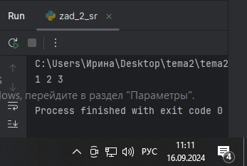

# Тема 2.
Отчет по Теме №2 выполнила:
- Ноговицина Ирина Андреевна
- ИВТ-22-2

| Задание | Лаб_раб | Сам_раб |
| --- | --- | --- |
| Задание 1 | + | + |
| Задание 2 | + | + |
| Задание 3 | + | + |
| Задание 4 | + | + |
| Задание 5 | + | + |
| Задание 6 | + | + |
| Задание 7 | + | + |
| Задание 8 | + | + |
| Задание 9 | + | + |
| Задание 10 | + | + |

знак "+" - задание выполнено; знак "-" - задание не выполнено;

Работу проверили:
- к.э.н., доцент Панов М.А.

# Самостоятельная работа №2
## Задание №1.Выведите в консоль булевую переменную False, не используя слово False в строке или изначально присвоенную булевую переменную. Программа должна занимать не более двух строк редактора кода.

```python
print (3>4)
```
### Результат.


### Выводы.
Данный код выводит в консоль "False", поскольку неравенство неверно.

## Задание №2.Присвоить значения трем переменным и вывести их в консоль, используя только две строки редактора кода.

```python
a, b, c = 1, 2, 3
print(a, b, c)
```
### Результат.


### Выводы.
В первой строке данного кода мы присваиваем переменным "a", "b", "c" значения "1", "2", "3" соответсвенно, во второй строке выводим эти значения в консоль.

## Задание №3.Реализуйте ввод данных в программу, через консоль, в виде только целых чисел (тип данных int). То есть при вводе буквенных символов в консоль, программа не должна работать. Программа должна занимать не более двух строк редактора кода.

```python
print(int(input("Введите целое число: ")))
```
### Результат.


### Выводы.
В данном коде через консоль вводится целое число, после чего оно выводится.

## Задание №4. Создайте только одну строковую переменную. Длина строки должна не превышать 5 символов. На выходе мы должны получить строку длиной ие менее 16 символов. Программа должна занимать не более двух строк редактора кода.

```python
a = "abcd"
print(a * 4)
```
### Результат.


### Выводы.
В данном коде строка из 4 символов повторяется 4 раза, следовательно в консоль выводится строка из 16 символов.

## Задание №5. Создайте три переменные: день (тип данных числовой), месяц (тип данных строка), год (тип данных числовой) и выведите в консоль текущую дату в формате: "Сегодня день месяц год. Всего хорошего!" используя F строку и оператор end внутри print(), в котором вы должны написать фразу "Всего хорошего!". Программа должна занимать не более двух строк редактора кода.

```python
day, month, year = 16, "сентября", 2024
print(f"Сегодня {day} {month} {year}. ", end="Всего хорошего!")
```
### Результат.


### Выводы.
В этом коде, используя зараннее присвоенные переменные, F строку и оператор end внутри print(), получается предложение "Сегодня 16 сентября 2024. Всего хорошего!".

## Задание №6. В предложении "Hello World" вставьте 'my" между двумя словами. Выведите полученное предложение в консоль в одну строку. Программа должна занимать не более двух строк редактора кода. 

```python
print("Hello World".replace(" ", " my "))
```
### Результат.


### Выводы.
В данном коде, с помощью оператора replace, выводится предложение "Hello my World".

## Задание №7. Узнайте длину предложения "Hello World", результат выведите в консоль. Программа должна занимать не более двух строк редактора кода.

```python
print (len ("Hello World"))
```
### Результат.


### Выводы.
В данном коде, с помощью метода len, выводится длина предложения "Hello World".

## Задание №8. Переведите предложение "HELLO WORLD" в нижний регистр. Программа должна занимать не более двух строк редактора кода.

```python
a = "HELLO WORLD".lower()
print(a)
```
### Результат.


### Выводы.
В данном коде, с помощью оператора lower, предложение "HELLO WORLD" переводится в нижний регистр.

## Задание №9. Реализуйте ввод данных в программу через консоль, в виде десятичных чисел (тип данных float). Выведите это число возведённое в квадрат.

```python
a=float(input("введите число"))
print(f"Число {a} возведённое в квадрат равно ", a*a)
```
### Результат.


### Выводы.
В данном коде, с помощью типа данных float и F строки, мы выводим в консоль квадрат десятичного числа.

## Задание №10. Реализуйте ввод стоки в программу через консоль и замените все пробелы знаками "_".

```python
stroka = str(input("введите ваше предложение:"))
predloz = stroka.replace(" ", "_")
print(predloz)
```
### Результат.


### Выводы.
В данном коде, с помощью оператора replace, мы заменяем пробелы знаками "_".

## Общий вывод по теме.
В теме 2 мы изучили базовые операции языка python.
