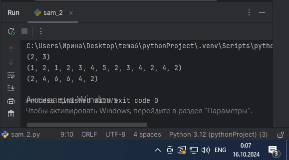
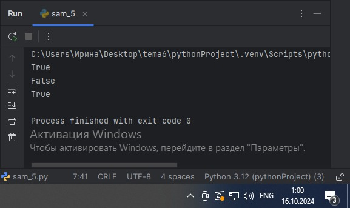

# Тема 3.
Отчет по Теме № 3 выполнила:
- Ноговицина Ирина Андреевна
- ИВТ-22-2

| Задание | Лаб_раб | Сам_раб |
| --- | --- | --- |
| Задание 1 | + | + |
| Задание 2 | + | + |
| Задание 3 | + | + |
| Задание 4 | + | + |
| Задание 5 | + | + |
| Задание 6 | + |   |
| Задание 7 | + |   |
| Задание 8 | + |   |
| Задание 9 | + |   |
| Задание 10 | + |   |

знак "+" - задание выполнено; знак "-" - задание не выполнено;

Работу проверили:
- к.э.н., доцент Панов М.А.

# Лабораторная работа № 3
## Задание № 1. Создайте две переменные, значение которых будете вводить через консоль. Также составьте условие, в котором созданные ранее переменные будут сравниваться, если условие выполняется, то выведете в консоль «Выполняется», если нет, то «Не выполняется».

```python
one = int(input('Введите значение первой переменной: '))
two = int(input('Введите значение второй переменной: '))
if one>=two:
    print('Выполняется')
else:
    print('Не выполняется')
```

### Результат.


### Выводы.
Данный код проверяет выполняется ли неравенство.

## Задание № 2. Напишите программу, которая будет определять значения переменной меньше 0, больше 0 и меньше 10 или больше 10. Это нужно реализовать при помощи одной переменной, значение которой будет вводится через консоль, а также при помощи конструкций if, elif, else.

```python
one = int(input('Введите значение первой переменной: '))
if one < 0:
    print('Переменная меньше 0')
elif 0 < one < 10:
    print('Переменная больше 0 и меньше 10')
else:
    print('Переменная больше 10')
```
### Результат.


### Выводы.
Данный код определяет значения переменной по 3 параметрам:
- меньше 0;
- от 0 до 10;
- больше 10.

## Задание № 3. Напишите программу, в которой будет проверяться есть ли переменная в указанном массиве используя логический оператор in. Самостоятельно посмотрите, как работает программа со значениями которых нет в массиве numbers.

```python
numbers = [1,3,4,6,8,9]
value = int(input('Введите значение переменной: '))
if value in numbers:
    print('Переменная есть в данном массиве')
else:
    print('Переменной нет в этом массиве')
```

### Результат.


### Выводы.
Данный код проверяет, есть ли введённая переменная в массиве.

## Задание № 4. Напишите программу, которая будет определять находится ли переменная в указанном массиве и если да, то проверьте четная она или нет. Самостоятельно протестируйте данную программу с разными значениями переменной value.

```python
numbers = [1,3,4,6,8,9,15,16,73,321,322]
value = int(input('Введите значение переменной: '))
if value in numbers:
    if value % 2 == 0:
        print('Переменная четная и есть в массиве numbers')
    else:
        print ('Переменная нечетная и есть в массиве numbers')
else:
    print(f"Переменной нет в массиве numbers и она равна {value}")
```

### Результат.


### Выводы.
Данный код проверяет, есть ли введённая переменная в массиве и её четность.

## Задание № 5. Напишите программу, в которой циклом for значения переменной i будут меняться от 0 до 10 и посмотрите, как разные виды сравнений и операций работают в цикле.

```python
for i in range (10):
    print('i = ', i)
    if i==0:
        i+=2
    if i==1:
        continue
    if i == 2 or i == 3:
        print('Переменная равна 2 или 3')
    elif i in [4,5,6]:
        print('Переменная равна 4,5 или 6')
    else:
        break
```

### Результат.


### Выводы.
Данный код выводит как меняются числа от 0 до 10, с помощью разных видов сравнений и операций.

## Задание № 6. Напишите программу, в которой при помощи цикла for определяется есть ли переменная value в строке string и посмотрите, как работает оператор else для циклов. Самостоятельно посмотрите, что выведет программа, если значение переменной value оказалось в строке string.

```python
string = 'Привет всем изучающим Python!'
value = input()
for i in string:
    if i == value:
        index = string.find(value)
        print(f"Буква '{value}' есть в строке под {index} индексом")
        break
else:
    print(f"Буквы '{value}' нет в указанной строке")
```

### Результат.


### Выводы.
Данный код, с помощью цикла for, определяет есть ли переменная value в строке string.

## Задание № 7. Напишите программу, в которой вы наглядно посмотрите, как работает цикл for проходя в обратном порядке, то есть, к примеру не от 0 до 10, а от 10 до 0. В уже готовой программе показано вычитание из 100, а вам во время реализации программы будет необходимо придумать свой вариант применения обратного цикла.

```python
value = 100
for i in range(10, -1, -1):
    value -= i
    print(i, value)
```

### Результат.


### Выводы.
Данный код выводит вычетания из 100 чисел от 10 до 0.

## Задание № 8. Напишите программу используя цикл while, внутри которого есть какие-либо проверки, но быть осторожным, поскольку циклы while при неправильно написанных условиях могут становится бесконечными, как указано в примере далее.

```python
value = 0
while value < 100:
    if value == 0:
        value += 10
    elif value // 5 > 1:
        value *= 5
    else:
        value -= 5
    print(value)
```

### Результат.


### Выводы.
Данный код проводит несколько проверок в цикле while и при этом не зацикливается.

## Задание № 9. Напишите программу с использованием вложенных циклов и одной проверкой внутри них. Самое главное, не забудьте, что нельзя использовать одинаковые имена итерируемых переменных, когда вы используете вложенные циклы.

```python
value = 0
for i in range(10):
    for j in range(10):
        if i != j:
            value += j
        else:
            pass
print(value)
```

### Результат.


### Выводы.
Данный код суммирует числа, с помощью вложенных циклов и одной проверкой.

## Задание № 10. Напишите программу с использованием flag, которое будет определять есть ли нечетное число в массиве. В данной задаче flag выступает в роли индикатора встречи нечетного числа в исходном массиве, четных чисел.

```python
even_array = [2,4,6,8,9]
flag = False
for value in even_array:
    if value % 2 == 1:
        flag = True

if flag is True:
    print('В массиве есть нечетное число')
else:
    print('В массиве все числа четные')
```

### Результат.


### Выводы.
Данный код определяет, есть ли нечётное число в массиве, с помощью flag.

# Самостоятельная работа № 3.
## Задание № 1.Напишите программу, которая преобразует 1 в 31. Для выполнения поставленной задачи необходимо обязательно и только один раз использовать: 
- Цикл for 
- *= 5
- += 1
- Никаких других действий или циклов использовать нельзя.

```python
for i in range(7):
    i*=5
print(i+1)
```

### Результат.


### Выводы.
Данный код преобразует 1 в 31, с помощью циклов и действий указанных в задании.

## Задание № 2. Напишите программу, которая фразу «Hello World» выводит в обратном порядке, и каждая буква находится в одной строке консоли.

```python
stroka = "Hello World"
for i in stroka[::-1]:
    print(i)
```

### Результат.


### Выводы.
Данный код выводит фразу «Hello World» в обратном порядке, и каждая буква находится в одной строке консоли. 

## Задание № 3. Напишите программу, на вход которой поступает значение из консоли, оно должно быть числовым и в диапазоне от 0 до 10 включительно (это необходимо учесть в программе). Если вводимое число не подходит по требованиям, то необходимо вывести оповещение об этом в консоль и остановить программу. Код должен вычислять в каком диапазоне находится полученное число. Результатом работы программы будет выведенный в консоль диапазон. Программа должна занимать не более 10 строчек в редакторе кода.

Нужно учитывать три диапазона: 
- от 0 до 3 включительно;
- от 3 до 6;
- от 6 до 10 включительно;

```python
numb = int(input())
if 0 <= numb <= 10:
    if (0<=numb<=3):
        print('Полученное число находится в диапазоне от 0 до 3 включительно')
    if (3<numb<6):
        print('Полученное число находится в диапазоне от 3 до 6')
    if (6<=numb<=10):
        print('Полученное число находится в диапазоне от 6 до 10 включительно')
else:
    print('Полученное число не подходит')
```

### Результат.


### Выводы.
Данный код выводит в каком из 3х диапазонов находится введённое число.

## Задание № 4. Манипулирование строками. Напишите программу на Python, которая принимает предложение (на английском) в качестве входных данных от пользователя. Проверьте работу программы минимум на 3 предложениях, чтобы охватить проверку всех поставленных условий.
Выполните следующие операции и отобразите результаты:
- Выведите длину предложения;
- Переведите предложение в нижний регистр;
- Подсчитайте количество гласных (a, e, i, o, u) в предложении;
- Замените все слова "ugly" на "beauty";
- Проверьте, начинается ли предложение с "The" и заканчивается ли на "end".

```python
stroka = input()
print(' 1. Длина предложения: ', len(stroka), "\n", '2. Перевод в нижний регистр: ', stroka.lower(), "\n", '3. Количество гласных (a, e, i, o, u):', stroka.count('a')+stroka.count('e')+stroka.count('i')+stroka.count('o')+stroka.count('u'), "\n", '4. Замена слов "ugly" на "beauty": ', stroka.replace("ugly","beauty"))
if stroka[:3]=='The' and stroka[-3:]=='end':
    print(" 5. Предложение начинается с The и заканчивается на end")
elif stroka[:3]=='The' and stroka[-3:]!='end':
    print(" 5. Предложение начинается с The и не заканчивается на end")
elif stroka[:3]!='The' and stroka[-3:]=='end':
    print(" 5. Предложение не начинается с The и заканчивается на end")
else:
    print(" 5. Предложение не начинается с The и не заканчивается на end")
```

### Результат.


### Выводы.
Данный код выполняет перечисленные в задании манипуляции.

## Задание № 5. Составьте программу, результатом которой будет данный вывод в консоль. Программу нужно составить из данных фрагментов кода.
Строки кода можно использовать только один раз. Не обязательно использовать все строки кода.

```python
string = 'hello'
values = [0,2,4,6,8,10]
counter = 0
while ' world' not in string:
    memory = string
    if counter in values:
        string = string + ' world'
    print(string)
    if counter < 10:
        string = memory
    counter+=1
```

### Результат.


### Выводы.
Данный код выводит 11 строк, чередуя строки "hello world" и "hello".

## Общий вывод по теме.
В теме 3 мы изучили работу с различными операторами, условиями и циклами.
