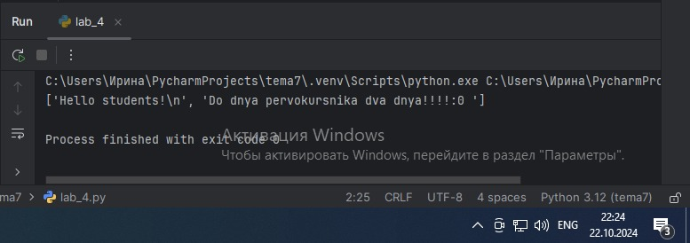
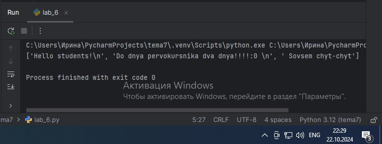

# Тема 4.
Отчет по Теме № 4 выполнила:
- Ноговицина Ирина Андреевна
- ИВТ-22-2

| Задание | Лаб_раб | Сам_раб |
| --- | --- | --- |
| Задание 1 | + | + |
| Задание 2 | + | + |
| Задание 3 | + | + |
| Задание 4 | + | + |
| Задание 5 | + | + |
| Задание 6 | + |   |
| Задание 7 | + |   |
| Задание 8 | + |   |
| Задание 9 | + |   |
| Задание 10 | + |   |

знак "+" - задание выполнено; знак "-" - задание не выполнено;

Работу проверили:
- к.э.н., доцент Панов М.А.

# Лабораторная работа № 4
## Задание № 1. Напишите функцию, которая выполняет любые арифметические действия и выводит результат в консоль. Вызовите функцию используя “точку входа”.

```python
def main():
    print(5*6)

if __name__ == '__main__':
    main()
```

### Результат.


### Выводы. 
Функция выполняет арифметическое действие и выводит результат в консоль.

## Задание № 2. Напишите функцию, которая выполняет любые арифметические действия, возвращает при помощи return значение в место, откуда вызывали функцию. Выведите результат в консоль. Вызовите функцию используя “точку входа”.

```python
def arithmetic():
    return 10 + 5

if __name__ == "__main__":
    result = arithmetic()
    print(result)
```
### Результат.


### Выводы.
Данная функция выполняет арифмитическое действие и возвращает при помощи return значение в место, откуда вызывали функцию.

## Задание № 3. Напишите функцию, в которую передаются два аргумента, над ними производится арифметическое действие, результат возвращается туда, откуда эту функцию вызывали. Выведите результат в консоль. Вызовите функцию в любом небольшом цикле. На скриншоте ниже приведен пример программы, в которой аргумент функции “x“превращается в параметр “one”, то же самое происходит с “y” и “two”.

```python
def main(one, two):
    return one + two

for i in range(5):
    answer = main(one=1, two=10)
    print(answer)
```

### Результат.


### Выводы.
Функция main заполняет переменную answer 5 раз.

## Задание № 4. Напишите функцию, на вход которой подается какое-то изначальное неизвестное количество аргументов, над которыми будет производится арифметические действия. Для выполнения задания необходимо использовать кортеж "args". На скриншоте ниже приведен пример такой программы с комментариями. Для закрепления понимания работы с кортежами настоятельно рекомендуем поменять аргументы вызова функции, вручную посчитать результат, только потом запустить программу с новыми значениями и проверить себя, насколько вы поняли данный аспект программирования.

```python
def main(x, *args):
    one = x
    two = sum(args)
    three = float(len(args))
    print(f"one={one}\ntwo={two}\nthree={three}")
    return x + sum(args) / float(len(args))

if __name__ == '__main__':
    result = main(10,0,1,2,-1,0,-1,1,2)
    print(f"\nresult={result}")
```

### Результат.


### Выводы.
Фунцие на вход подается какое-то изначальное неизвестное количество аргументов, над которыми производятся арифметические действия.

## Задание № 5. Напишите функцию, которая на вход получает кортеж “kwargs” и при помощи цикла выводит значения, поступившие в функцию. На скриншоте ниже указаны два варианта вызова функции с “kwargs” и два варианта работы с данными, поступившими в эту функцию. Комментарии в коде и теоретическая часть помогут вам разобраться в этом нелегком аспекте. Вызовите функцию используя “точку входа”. 
 
```python
def main(**kwargs):
    for i in kwargs.items():
        print(i[0],i[1])
    print()

    for key in kwargs:
        print(f"{key}={kwargs[key]}")

if __name__ == "__main__":
    main(x=[1,2,3],y=[3,3,0],z=[2,3,0],q=[3,3,0],w=[3,3,0])
    print()
    main(**{'x': [1,2,3], 'y': [3,3,0]})
```

### Результат.


### Выводы.
Функция принимает кортеж kwargs и выводит значения через цикл.

## Задание № 6. Напишите две функции. Первая – получает в виде параметра “kwargs”. Вторая считает среднее арифметическое из значений первой функции. Вызовите первую функцию используя “точку входа” и минимум 4 аргумента.

```python
def get_values(**kwargs):
    return list(kwargs.values())

def calculate_average(*args):
    return sum(args) / len(args) if args else 0

if __name__ == "__main__":
    values = get_values(a=10, b=20, c=30, d=40)
    average = calculate_average(*values)
    print(f'Среднее: {average}')
```

### Результат.


### Выводы.
Первая функция получает kwargs, вторая расчитывает среднее.

## Задание № 7. Cоздайте дополнительный файл .py. Напишите в нем любую функцию, которая будет что угодно выводить в консоль, но не вызывайте ее в нем. Откройте файл main.py, импортируйте в него функцию из нового файла и при помощи “точки входа” вызовите эту функцию.

```python
def greeting():
    print("Привет из другого файла!")
```

```python
from other_file import greeting

if __name__ == "__main__":
    greeting()
```

### Результат.


### Выводы.
Используется функция greeting из другого файла.

## Задание № 8. Напишите программу, которая будет выводить корень, синус, косинус полученного от пользователя числа.

```python
import math

if __name__ == "__main__":
    number = float(input("Введите число: "))
    root = math.sqrt(number)
    sin_value = math.sin(number)
    cos_value = math.cos(number)
    
    print(f"Корень числа: {root}")
    print(f"Синус числа: {sin_value}")
    print(f"Косинус числа: {cos_value}")
```

### Результат.


### Выводы. 
Получение корня, синуса, косинуса от введённого числа.

## Задание № 9. Напишите программу, которая будет рассчитывать какой день недели будет через n-нное количество дней, которые укажет пользователь.

```python
import datetime

if __name__ == "__main__":
    n = int(input("Введите количество дней: "))
    today = datetime.date.today()
    future_date = today + datetime.timedelta(days=n)
    print(f"День недели через {n} дней: {future_date.strftime('%A')}")
```

### Результат.


### Выводы.
Рассчет какой день недели будет через n-нное количество дней.

## Задание № 10. Напишите программу с использованием глобальных переменных, которая будет считать площадь треугольника или прямоугольника в зависимости от того, что выберет пользователь. Получение всей необходимой информации реализовать через input(), а подсчет площадей выполнить при помощи функций. Результатом программы будет число, равное площади, необходимой фигуры.

```python
def triangle_area(base, height):
    return 0.5 * base * height

def rectangle_area(length, width):
    return length * width

if __name__ == "__main__":
    shape = input("Выберите фигуру (треугольник/прямоугольник): ").strip().lower()
    
    if shape == "треугольник":
        base = float(input("Введите основание треугольника: "))
        height = float(input("Введите высоту треугольника: "))
        area = triangle_area(base, height)
        print(f"Площадь треугольника: {area}")
    elif shape == "прямоугольник":
        length = float(input("Введите длину прямоугольника: "))
        width = float(input("Введите ширину прямоугольника: "))
        area = rectangle_area(length, width)
        print(f"Площадь прямоугольника: {area}")
    else:
        print("Неизвестная фигура")
```

### Результат.


### Выводы.
Данный код выводит площадь треугольника или квадрата.

# Самостоятельная работа № 4
## Задание № 1. Дайте подробный комментарий для кода, написанного ниже. Комментарий нужен для каждой строчки кода, нужно описать что она делает. Не забудь те, что функции комментируются по-особенному.

```python
from datetime import datetime 
from math import sqrt 
def main(**kwargs):
    for key in kwargs.items(): 
        result = sqrt(key[1][0] ** 2 + key[1][1] ** 2) 
        print(result) 
if __name__ == '__main__':
    start_time = datetime.now()
    main( 
    one=[10, 3],
    two=[5, 4],
    three=[15, 13],
    four=[93, 53],
    five=[133, 15]
    )
    time_costs = datetime.now() - start_time 
    print(f"Время выполнения программы - {time_costs}")
```

### Результат.


### Выводы.
В код добавленны комментарии.

## Задание № 2. Напишите программу, которая будет заменять игральную кость с 6 гранями. Если значение равно 5 или 6, то в консоль выводится «Вы победили», если значения 3 или 4, то вы рекурсивно должны вызвать эту же функцию, если значение 1 или 2, то в консоль выводится «Вы проиграли». При этом каждый вызов функции необходимо выводить в консоль значение “кубика”. Для выполнения задания необходимоиспользовать стандартную библиотеку random. Программу нужно написать, используя одну функцию и “точку входа”Напишите программу, которая фразу «Hello World» выводит в обратном порядке, и каждая буква находится в одной строке консоли.

```python
import random
def roll(num):
    match num:
        case 1:
            print('Вы проиграли')
        case 2:
            print('Вы проиграли')
        case 3:
            roll(random.randint(1,6))
        case 4:
            roll(random.randint(1, 6))
        case 5:
            print('Вы победили')
        case 6:
            print('Вы победили')

if __name__ == '__main__':
    roll(random.randint(1, 6))
```

### Результат.


### Выводы.
Функция roll через switch case выбирает какой исход будет

## Задание № 3. Напишите программу, которая будет выводить текущее время, с точностью до секунд на протяжении 5 секунд. Программу нужно написать с использованием цикла. Подсказка: необходимо использовать модуль datetime и time, а также вам необходимо как-то “усыплять” программу на 1 секунду.

```python
import time
from datetime import datetime

for i in range(5):
    now = datetime.now()
    current_time = now.strftime("%I:%M:%S")
    print(f"Время: {current_time}")
    time.sleep(1)
```

### Результат.


### Выводы.
Программа выводит точное время до секунд на протяжении 5 секунд

## Задание № 4. Напишите программу, которая считает среднее арифметическое от аргументов вызываемое функции, с условием того, что изначальное количество этих аргументов неизвестно. Программу необходимо реализовать используя одну функцию и “точку входа”.

```python
def avg(*args):
    print(sum(args)/ len(args))
if __name__ == '__main__':
    avg(5,10,12,30)
```

### Результат.


### Выводы.
Функция avg считает среднее арифметическое.

## Задание № 5. Создайте два Python файла, в одном будет выполняться вычисление площади треугольника при помощи формулы Герона (необходимо реализовать через функцию), а во втором будет происходить взаимодействие с пользователем (получение всей необходимой информации и вывод результатов). Напишите эту программу и выведите в консоль полученную площадь.

```python
import math

def calculate_area(a, b, c):
    s = (a + b + c) / 2  
    area = math.sqrt(s * (s - a) * (s - b) * (s - c))  
    return area
```
```python
from triangle_area import calculate_area

if __name__ == "__main__":
    a = float(input("Введите длину стороны a: "))
    b = float(input("Введите длину стороны b: "))
    c = float(input("Введите длину стороны c: "))
    
    area = calculate_area(a, b, c)
    print(f"Площадь треугольника: {area}")
```

### Результат.


### Выводы.
В файле triangle_area.ry функция calculate_area считает по заданным параметрам площадь.

## Общий вывод по теме.
В данной теме мы изучили функции и стандартные модули/библиотеки.
