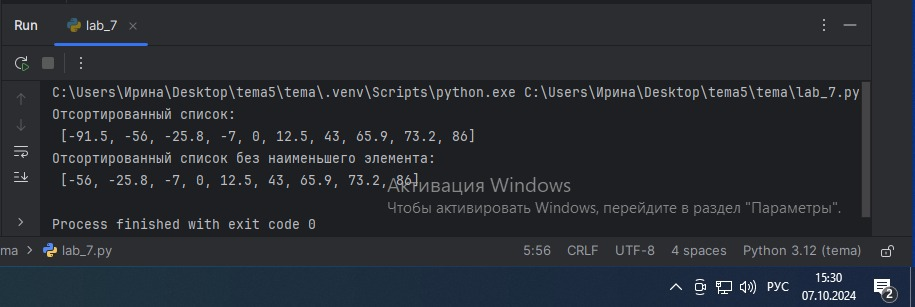
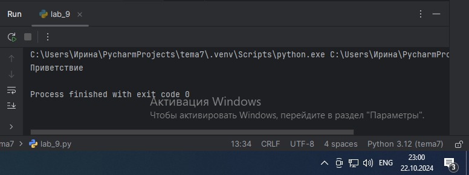
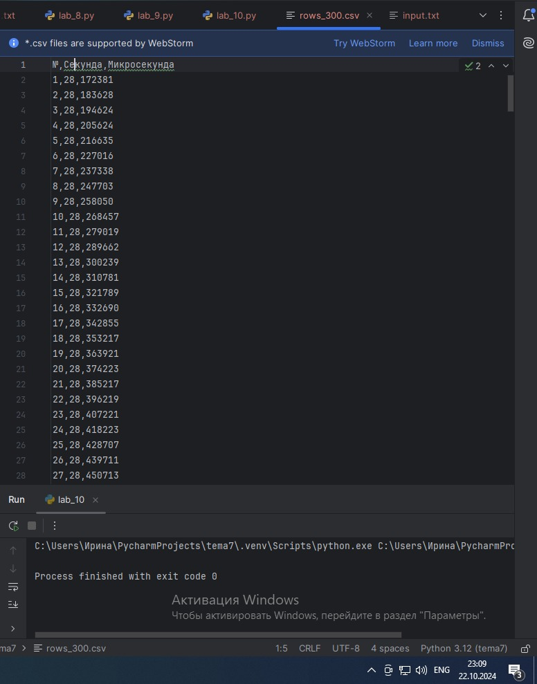

# Тема 5.
Отчет по Теме № 5 выполнила:
- Ноговицина Ирина Андреевна
- ИВТ-22-2

| Задание | Лаб_раб | Сам_раб |
| --- | --- | --- |
| Задание 1 | + | + |
| Задание 2 | + | + |
| Задание 3 | + | + |
| Задание 4 | + | + |
| Задание 5 | + | + |
| Задание 6 | + |  |
| Задание 7 | + |  |
| Задание 8 | + |  |
| Задание 9 | + |  |
| Задание 10 | + |  |

знак "+" - задание выполнено; знак "-" - задание не выполнено;

Работу проверили:
- к.э.н., доцент Панов М.А.


# Лабораторная работа № 5
## Задание № 1.
Друзья предложили вам поиграть в игру “найди отличия и убери повторения (версия для программистов)”. Суть игры состоит в том, что на вход программы поступает два множества, а ваша задача вывести все элементы первого, которых нет во втором. А вы как раз недавно прошли множества и знаете их возможности, поэтому это не составит для вас труда.

```python
set_1 = {'white', 'black', 'red', 'pink'}
set_2 = {'red', 'green', 'blue', 'red'}

print (set_1 - set_2)
```

### Результат.


### Выводы.
Функция print в данном коде выводит слова из первого множества, которых нет во втором.

## Задание № 2.
Напишите две одинаковые программы, только одна будет использовать set(), а вторая frozenset() и попробуйте к исходному множеству добавить несколько элементов, например, через цикл. 
- Вариант с set():

```python
a = set('abcdefg')
print(a)
for i in range (1, 5):
    a.add(i)
print(a)
```

### Результат.


- Вариант с frozenset():

```python
a = frozenset('abcdefg')
print(a)
for i in range (1, 5):
    a.add(i)
print(a)
```

### Результат.


### Выводы.
Множество set() можно изменить, а frozenset() является неизменяемым множеством

## Задание № 3.
На вход в программу поступает список (минимальной длиной 2 символа). Напишите программу, которая будет менять первый и последний элемент списка.

```python
def replace(input_list):
    memory = input_list[0]
    input_list[0] = input_list[-1]
    input_list[-1] = memory

    return input_list

print(replace([1, 2, 3, 4, 5]))
```

### Результат.


### Выводы.
Данный код меняет первый и последний элемент списка.

## Задание № 4
На вход в программу поступает список (минимальной длиной 10 символов). Напишите программу, которая выводит элементы с индексами от 2 до 6. В программе необходимо использовать “срез”.

```python
a = [12, 54, 32, 57, 843, 2346, 765, 75, 25, 234, 756, 23]
print(a[2:6])
```

### Результат.


### Выводы.
Программа выводит элементы списка с 3 по 7. 

## Задание № 5.
Иван задумался о поиске «бесполезного» числа, полученного из списка. Суть поиска в следующем: он берет произвольный список чисел, находит самое большое из них, а затем делит его на длину списка. Студент пока не придумал, где может пригодиться подобное значение, но ищет у вас помощи в реализации такой функции useless().

```python
def useless(lst):
    return max(lst) / len(lst)

print(useless([3, 5, 7, 3, 33]))
print(useless([-12.5, 54, 77.3, 0, -36, 98.2, -63, 21.7, 47, -89.6]))
print(useless([-25.8, 86, 12.5, -56, 73.2, 0, 43, -91.5, 65.9, -7]
```

### Результат.


### Выводы.
В данном коде функция useless находит самое большое число в списке и делит его на длину списка.

## Задание № 6.
Ребята не могут определится каким супергероем они хотят стать. У них есть случайно составленный список супергероев, и вы должны определить кто из ребят будет каким супергероем.

```python
superheroes = ['superman', 'spiderman', 'batman']

nikolay, vasiliy, ivan = superheroes

print('Николай - ', nikolay)
print('Василий - ', vasiliy)
print('Иван - ', ivan)
```

### Результат.


### Выводы.
Данная программа распределяет супергероев из начального списка к мальчикам.

## Задание № 7.
Вовочка, насмотревшись передачи “Слабое звено” решил написать программу, которая также будет находить самое слабое звено (минимальный элемент) и удалять его, только делать он это хочет не с людьми, а со списком. Помогите Вовочке с реализацией программы. Подсказка: для этого вам необходимо отсортировать список и удалить значение при помощи pop()

```python
a = [-25.8, 86, 12.5, -56, 73.2, 0, 43, -91.5, 65.9, -7]
a.sort()
print('Отсортированный список:\n', a)
a.pop(0)
print('Отсортированный список без наименьшего элемента:\n', a)
```

### Результат.


### Выводы.
В данном коде происходит сортировка списка от наименьшего до наибольшего с помощью sort() и удаление наименьшего числа с помощью pop().

## Задание №8.
Михаил решил создать большой n-мерный список, для этого он случайным образом создал несколько списков, состоящих минимум из 3, а максимум из 10 элементов и поместил их в один большой список. Он также как и Иван не знает зачем ему это сейчас нужно, но надеется на то, что это пригодится ему в будущем.

```python
from random import randint

def list_maker():
    a = [randint(1,100)] * randint(3,10)
    return a

if __name__ == '__main__':
    result = []
    for i in range (randint(1,5)):
        result.append(list_maker())

    print(result)
```

### Результат.


### Выводы.
В данном коде функция list_maker создает несколько списков, которые потом объединяются в один.

## Задание № 9.
Вы работаете в ресторане и отвечает за статистику покупок, ваша задача сравнить между собой заказы покупателей, которые указаны в разном порядке. Реализуйте функцию superset(), которая принимает 2 множества. Результат работы функции: вывод в консоль одного из сообщений в зависимости от ситуации: 
- «Супермножество не обнаружено»
– «Объект {X} является чистым супермножеством» 
– «Множества равны»

```python
def superset(set_1, set_2):
    if set_1 > set_2:
        print(f'Объект {set_1} является чистым супермножеством')
    elif set_1 == set_2:
        print('Множества равны')
    elif set_1 < set_2:
        print(f'Объект {set_2} является чистым супермножеством')
    else:
        print('Супермножеств не обнаружено')

if __name__ == '__main__':
    superset({1, 8, 3, 5}, {3, 5})
    superset({1, 8, 3, 5}, {5, 3, 8, 1})
    superset({3, 5}, {5, 3, 8, 1})
    superset({90, 100}, {3, 5})
```

### Результат.


### Выводы.
В данном коде функция superset() принимает 2 множества и выводит в консоль сообщение в зависимости от ситуации.

## Задание № 10.
Предположим, что вам нужно разобрать стопку бумаг, но нужно начать работу с нижней, “переверните стопку”. Вам дан произвольный список. Представьте его в обратном порядке. Программа должна занимать не более двух строк в редакторе кода.

```python
my_list = [2, 5, 8 ,3]
print(my_list[::-1])
```

### Результат.


### Выводы.
Данный код выводит список, начиная с последнего значения и заканчивая начальным значением из произвольного списка.

# Самостоятельная работа № 5.
## Задание № 1.
Ресторан на предприятии ведет учет посещений за неделю при помощи кода работника. У них есть список со всеми посещениями за неделю. Ваша задача посчитать: 
- Сколько было выдано чеков 
- Сколько разных людей посетило ресторан 
- Какой работник посетил ресторан больше всех раз 

Список выданных чеков за неделю: [8734, 2345, 8201, 6621, 9999, 1234, 5678, 8201, 8888, 4321, 3365,  1478, 9865, 5555, 7777, 9998, 1111, 2222, 3333, 4444, 5556, 6666, 5410, 7778, 8889, 4445, 1439, 9604, 8201, 3365, 7502, 3016, 4928, 5837, 8201, 2643, 5017, 9682, 8530, 3250, 7193, 9051, 4506, 1987, 3365, 5410, 7168, 7777, 9865, 5678, 8201, 4445, 3016, 4506, 4506] 

Результатом выполнения задачи будет: листинг кода, и вывод в консоль, в котором будет указана вся необходимая информация.

```python
from collections import Counter

checks = [8734, 2345, 8201, 6621, 9999, 1234, 5678, 8201, 8888, 4321, 3365, 1478, 9865, 5555, 7777, 9998, 1111, 2222, 3333, 4444, 5556, 6666,5410, 7778, 8889, 4445, 1439, 9604,
          8201, 3365, 7502, 3016, 4928, 5837, 8201, 2643, 5017, 9682, 8530, 3250, 7193, 9051, 4506, 1987, 3365, 5410, 7168, 7777, 9865, 5678, 8201, 4445, 3016, 4506, 4506]

countChecks = len(checks)
differentChecks = len(set(checks))
visits = Counter(checks)
mostVisits = visits.most_common(1)[0]

print(f'Количество чеков: {countChecks}')
print(f'Количество разных людей посетивших ресторан: {differentChecks}')
print(f'Больше всех раз посетил ресторвн работник {mostVisits[0]}')
```

### Результат.


### Выводы.
Данный код считает количество чеков сотрудников; количество сотрудников, посещающих ресторан; определяет сотрудника, посетившего ресторан наибольшее количество раз.

## Задание № 2. 
На физкультуре студенты сдавали бег, у преподавателя физкультуры есть список всех результатов, ему нужно узнать: 
- Три лучшие результата 
- Три худшие результата 
- Все результаты начиная с 10

Ваша задача помочь ему в этом. Список результатов бега: [10.2, 14.8, 19.3, 22.7, 12.5, 33.1, 38.9, 21.6, 26.4, 17.1, 30.2, 35.7, 16.9,  
27.8, 24.5, 16.3, 18.7, 31.9, 12.9, 37.4] 

Результатом выполнения задачи будет: листинг кода, и вывод в консоль, в котором будет указана вся необходимая информация.


```python
results = [10.2, 14.8, 19.3, 22.7, 12.5, 33.1, 38.9, 21.6, 26.4, 17.1, 30.2, 35.7, 16.9, 27.8, 24.5, 16.3, 18.7, 31.9, 12.9, 37.4]

print(f"Три лучших результата: {sorted(results)[:3]}")
print(f"Три худших результата: {sorted(results)[-3:]}")
print(f"Все результаты начиная с 10: {results[9:]}")
```

### Результат.


### Выводы.
Данный код выводит три лучших результата; три худших результата; все результаты, начиная с 10.

## Задание № 3.
Преподаватель по математике придумал странную задачку. У вас есть три списка с элементами, каждый элемент которых – длина стороны треугольника, ваша задача найти площади двух треугольников, составленные из максимальных и минимальных элементов полученных списков. Результатом выполнения задачи будет: листинг кода, и вывод в консоль, в котором будут указаны два этих значения. Три списка:
- one = [12, 25, 3, 48, 71] 
- two = [5, 18, 40, 62, 98] 
- three = [4, 21, 37, 56, 84]

```python
import math

one = [12, 25, 3, 48, 71]
two = [5, 18, 40, 62, 98]
three = [4, 21, 37, 56, 84]

min_one = min(one)
max_one = max(one)
min_two = min(two)
max_two = max(two)
min_three = min(three)
max_three = max(three)

triangle1 = [max_one, max_two, max_three]
triangle2 = [min_one, min_two, min_three]

def squareTriangle(sides):
    a, b, c = sides
    s = (a + b + c) / 2
    square = math.sqrt(s * (s - a) * (s - b) * (s - c))
    return square
square_triangle1 = squareTriangle(triangle1)
square_triangle2 = squareTriangle(triangle2)


print("Площадь треугольника с максимальными элементами:", square_triangle1)
print("Площадь треугольника с минимальными элементами:", square_triangle2)
```

### Результат.


### Выводы.
Данный код формирует два треугольника по максимальным и минимальным значениям из 3 списков и считает их площадь.

## Задание № 4.
Никто не любит получать плохие оценки, поэтому Борис решил это исправить. Допустим, что все оценки студента за семестр хранятся в одном списке. Ваша задача удалить из этого списка все двойки, а все тройки заменить на четверки. 

Списки оценок (проверить работу программы на всех трех вариантах): 

[2, 3, 4, 5, 3, 4, 5, 2, 2, 5, 3, 4, 3, 5, 4] 

[4, 2, 3, 5, 3, 5, 4, 2, 2, 5, 4, 3, 5, 3, 4] 

[5, 4, 3, 3, 4, 3, 3, 5, 5, 3, 3, 3, 3, 4, 4] 

Результатом выполнения задачи будет: листинг кода, и вывод в консоль, в котором будут три обновленных массива.

```python
gradesList1 = [2, 3, 4, 5, 3, 4, 5, 2, 2, 5, 3, 4, 3, 5, 4]
gradesList2 = [4, 2, 3, 5, 3, 5, 4, 2, 2, 5, 4, 3, 5, 3, 4]
gradesList3 = [5, 4, 3, 3, 4, 3, 3, 5, 5, 3, 3, 3, 3, 4, 4]

def updateGrades(grades):
    updateGrades = [4 if a == 3 else a for a in grades if a != 2]
    return updateGrades
grades1 = updateGrades(gradesList1)
grades2 = updateGrades(gradesList2)
grades3 = updateGrades(gradesList3)

print(grades1)
print(grades2)
print(grades3)
```

### Результат.


### Выводы.
В данном коде функция updateGrades заменяет значения "3" на значения "4" и переносит остальные значения в новый список, кроме значения "2".

## Задание № 5.
Вам предоставлены списки натуральных чисел, из них необходимо сформировать множества. При этом следует соблюдать это правило: если какое-либо число повторяется, то преобразовать его в строку по следующему образцу: например, если число 4 повторяется 3 раза, то в множестве будет следующая запись: само число 4, строка «44», строка «444». 

Множества для теста: 

list_1 = [1, 1, 3, 3, 1]

list_2 = [5, 5, 5, 5, 5, 5, 5]

list_3 = [2, 2, 1, 2, 2, 5, 6, 7, 1, 3, 2, 2]

Результаты вывода (порядок может отличаться, поскольку мы работаем с set()):

{'11', 1, 3, '33', '111'} 

{5, '5555', '555555', '55555', '555', '55', '5555555'} 

{'11', 1, 3, 2, 5, 6, '222222', '222', 7, '2222', '22222', '22'}

```python
list_1 = [1, 1, 3, 3, 1]
list_2 = [5, 5, 5, 5, 5, 5, 5]
list_3 = [2, 2, 1, 2, 2, 5, 6, 7, 1, 3, 2, 2]

def createSet(list):
    counts = {}

    for num in list:
        if num in counts:
            counts[num] += 1
        else:
            counts[num] = 1
    result = set()

    for num, count in counts.items():
        result.add(num)
        for i in range(1, count):
            result.add(str(num) * (i + 1))
    return result

set_1 = createSet(list_1)
set_2 = createSet(list_2)
set_3 = createSet(list_3)

print(set_1)
print(set_2)
print(set_3)
```

### Результат.


### Выводы.
В данном коде функция createSet формирует множества из повторяющихся чисел.

## Общий вывод по теме.
В данной теме мы изучили базовые коллекции: строки и списки.
