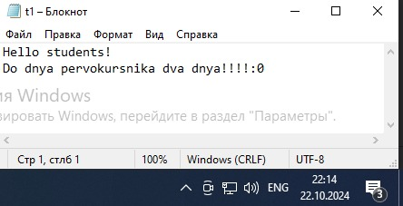
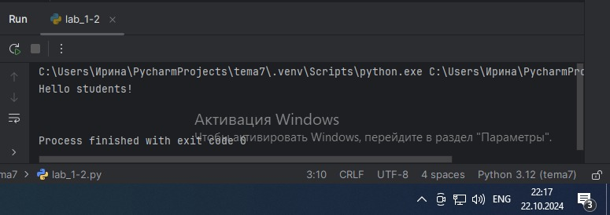
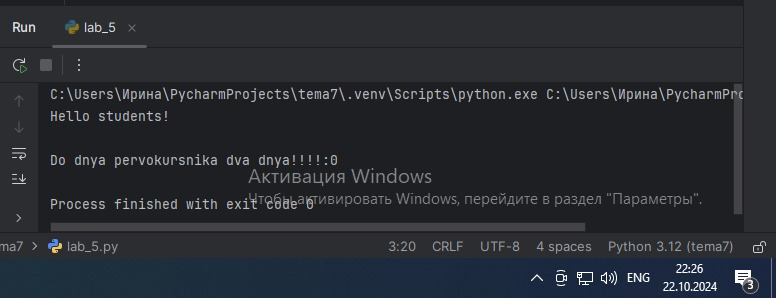
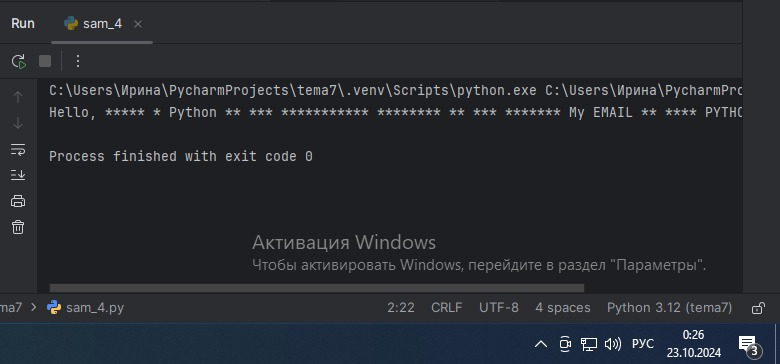

# Тема 7.
Отчет по Теме № 7 выполнила:
- Ноговицина Ирина Андреевна
- ИВТ-22-2

| Задание | Лаб_раб | Сам_раб |
| --- | --- | --- |
| Задание 1 | + | + |
| Задание 2 | + | + |
| Задание 3 | + | + |
| Задание 4 | + | + |
| Задание 5 | + | + |
| Задание 6 | + |  |
| Задание 7 | + |  |
| Задание 8 | + |  |
| Задание 9 | + |  |
| Задание 10 | + |  |

знак "+" - задание выполнено; знак "-" - задание не выполнено;

Работу проверили:
- к.э.н., доцент Панов М.А.


# Лабораторная работа № 7
## Задание № 1.
Составьте текстовый файл и положите его в одну директорию спрограммой на Python. Текстовый файл должен состоять минимум из двух строк.

### Результат.


### Выводы.
Создан текстовый файл из двух строк.

## Задание № 2.
Напишите программу, которая выведет только первую строку из вашего файла, при этом используйте конструкцию open()/close().

```python
f = open('t1.txt', 'r')
print(f.readline())
f.close()
```

### Результат.


### Выводы.
Данный код выводит только первую строку текстового файла, с помощью конструкции open()/close().

## Задание № 3.
Напишите программу, которая выведет все строки из вашего файла в массиве, при этом используйте конструкцию open()/close().

```python
f = open('t1.txt', 'r')
print(f.readlines())
f.close()
```

### Результат.


### Выводы.
Данный код выводит все строки текстового файла, с помощью конструкции open()/close().

## Задание № 4
Напишите программу, которая выведет все строки из вашего файла в массиве, при этом используйте конструкцию with open().

```python
with open('t1.txt') as f:
    print(f.readlines())
```

### Результат.


### Выводы.
Данный код выводит все строки текстового файла в массиве, с помощью конструкции with open().

## Задание № 5.
Напишите программу, которая выведет каждую строку из вашего файла отдельно, при этом используйте конструкцию with open().

```python
with open('t1.txt') as f:
    for line in f:
        print(line)
```

### Результат.


### Выводы.
Данный код выводит все строки текстового файла отдельно, с помощью конструкции with open().

## Задание № 6.
Напишите программу, которая будет добавлять новую строку в ваш файл, а потом выведет полученный файл в консоль. Вывод можно осуществлять любым способом. Обязательно проверьте сам файл, чтобы изменения в нем тоже отображались.

```python
with open('t1.txt', 'a+') as f:
    f.write('\n Sovsem chyt-chyt')

with open('t1.txt', 'r') as f:
    result = f.readlines()
    print(result)
```

### Результат.


### Выводы.
Данный код добавляет в текстовый файл новую стоку.

## Задание № 7.
Напишите программу, которая перепишет всю информацию, которая была у вас в файле до этого, например напишет любые данные из произвольно вами составленного списка. Также не забудьте проверить что измененная вами информация сохранилась в файле

```python
lines = ['one', 'two', 'three']
with open('t1.txt', 'w') as f:
    for line in lines:
        f.write('\nString '+ line)
    print('Done')
```

### Результат.

- До:
  

- После:
  


### Выводы.
Данный код переписывает данные в текстовом файле.

## Задание №8.
Выберите любую папку на своем компьютере, имеющую вложенные директории. Выведите на печать в терминал ее содержимое, как и всех подкаталогов при помощи функции print_docs(directory).

```python
import os


def print_docs(directory):
    all_files = os.walk(directory)
    for catalog in all_files:
        print(f'Папка {catalog[0]} cодержит:')
        print(f'Директории: {", ".join([folder for folder in catalog[1]])}')
        print(f'Файлы: {", ".join([file for file in catalog[2]])}')
        print('-' * 48)

print_docs('C:/Users/Ирина/Desktop/tema3')
```

### Результат.


### Выводы.
Данный код выводит в терминал содержимое выбранной папки (её директории и файлы) при помощи функции print_docs(directory).

## Задание № 9.
Требуется реализовать функцию, которая выводит слово, имеющее максимальную длину (или список слов, если таковых несколько).

```python
def longest_words(file):
    with open(file, encoding='utf-8') as f:
        words = f.read().split()
        max_lenght = len(max(words, key=len))
        for word in words:
            if len(word) == max_lenght:
                sought_words = word

        if len(sought_words) == 1:
            return sought_words[0]
        return sought_words

print(longest_words('input.txt'))
```

### Результат.


### Выводы.
Данный код выводит самое длинное слово в текстовом файле.

## Задание № 10.
Требуется создать csv-файл «rows_300.csv» со следующими столбцами: 
- № - номер по порядку (от 1 до 300);
- Секунда – текущая секунда на вашем ПК;
- Микросекунда – текущая миллисекунда на часах.

Для наглядности на каждой итерации цикла искусственно приостанавливайте скрипт на 0,01 секунды.

```python
import csv
import datetime
import time


with open('rows_300.csv', 'w', encoding='utf-8', newline='') as f:
    writer = csv.writer(f)
    writer.writerow(['№ ', 'Секунда ', 'Микросекунда'])
    for line in range (1, 301):
        writer.writerow([line, datetime.datetime.now().second, datetime.datetime.now().microsecond])
        time.sleep(0.01)
```

### Результат.


### Выводы.
Данный код создаёт csv-файл «rows_300.csv» со требуемыми столбцами.

# Самостоятельная работа № 7.
## Задание № 1.
Найдите в интернете любую статью (объем статьи не менее 200 слов), скопируйте ее содержимое в файл и напишите программу, которая считает количество слов в текстовом файле и определит самое часто встречающееся слово. Результатом выполнения задачи будет: скриншот файла со статьей, листинг кода, и вывод в консоль, в котором будет указана вся необходимая информация.

Скриншот файла со статьей:


```python
from collections import Counter

def word_count(file):
    result = 0
    with open(file,'r') as file:
        data = file.read()
        lines = data.split()
        result+=len(lines)
    print(result)

def most_said(file):
    with open(file, 'r') as file:
        data = file.read()
        split_it = data.split()
        most_occur = Counter(split_it).most_common(4)
    print(most_occur)

print(word_count('statya.txt'),most_said('statya.txt'))
```

### Результат.


### Выводы.
Данный код считатет количество слов в текстовом файле и выводит самое часто встречающееся слово.

## Задание № 2. 
У вас появилась потребность в ведении книги расходов, посмотрев все существующие варианты вы пришли к выводу что вас ничего не устраивает и нужно все делать самому. Напишите программу для учета расходов. Программа должна позволять вводить информацию о расходах, сохранять ее в файл и выводить существующие данные в консоль. Ввод информации происходит через консоль. Результатом выполнения задачи будет: скриншот файла с учетом расходов, листинг кода, и вывод в консоль, с демонстрацией работоспособности программы.

Скриншот файла с учётом расходов:


```python
def record_expense(filename):
    while True:
        expense_item = input("Введите название расхода (или 'отмена' для выхода): ")
        if expense_item.lower() == 'отмена':
            break
        expense_amount = input("введите данные расходов:")

        with open(filename, 'a', encoding='utf-8') as file:
            file.write(f"{expense_item}: {expense_amount}\n")

    print()
    with open(filename, 'r', encoding='utf-8') as file:
        print(file.read())

filename = 'raskhod.txt'
record_expense(filename)
```

### Результат.


### Выводы.
Данный код записывает данные в тексовый файл расходы.

## Задание № 3.
Имеется файл input.txt с текстом на латинице. Напишите программу, которая выводит следующую статистику по тексту: количество букв латинского алфавита; число слов; число строк. 
- Текст в файле:

  Beautiful is better than ugly.

  Explicit is better than implicit.

  Simple is better than complex.

  Complex is better than complicated.

- Ожидаемый результат:

  Input file contains:

  108 letters

  20 words

  4 lines

```python
def analyze_text(filename):
    try:
        with open(filename, 'r', encoding='utf-8') as file:
            text = file.read()
            letter_count = sum(c.isalpha() for c in text)
            word_count = len(text.split())
            line_count = text.count('\n') + 1
            print(f"Input file contains:\n{letter_count} letters\n{word_count} words\n{line_count} lines")
    except FileNotFoundError:
        print("Файл не найден.")

analyze_text('input1.txt')
```

### Результат.


### Выводы.
Данный код выводит статистику по тексту: количество букв латинского алфавита; число слов; число строк.

## Задание № 4.
Напишите программу, которая получает на вход предложение, выводит его в терминал, заменяя все запрещенные слова звездочками. Запрещенные слова, разделенные символом пробела, хранятся в текстовом файле input.txt. Все слова в этом файле записаны в нижнем регистре. Программа должна заменить запрещенные слова, где бы они ни встречались, даже в середине другого слова. Замена производится независимо от регистра:если файл input.txt содержит запрещенное слово exam, то слова exam, Exam, ExaM и exAm должны быть заменены на ****.
- Запрещенные слова:

hello email python the exam wor is

- Предложение для проверки:

Hello, world! Python IS the programming language of thE future. My EMAIL is.... PYTHON is awesome!!!! 

- Ожидаемый результат:

****, ***ld! ****** *** programming language of *** future. My ***** .... ****** ** awesome!!!!

```python
def censor_sentence(sentence):
    with open('input2.txt', 'r', encoding='utf-8') as file:
        forbidden_words = file.read().split()
    words = sentence.split()
    censored_words = []
    for word in words:
        lowercase_word = word.lower()
        for fword in forbidden_words:
            if (lowercase_word.find(fword) >= 0):
                censored_word = lowercase_word.replace(fword, '*' * len(fword))
                censored_words.append(censored_word)
                break
        else:
            censored_words.append(word)
    censored_sentence = ' '.join(censored_words)
    print(censored_sentence)

sentence = "Hello, world ! Python IS the programming language of thE future. My EMAIL is .... PYTHON is awesome!!!!"
censor_sentence(sentence)
```

### Результат.


### Выводы.
Данный код заменяет запрещённые слова звёздочками.

## Задание № 5.
Написать программу, которая будет подсчитывает количество использования каждого символа в текстовом файле.

Скриншот текстового файла:


```python
def count_characters(filename):
    with open(filename, 'r') as file:
        text = file.read()

    char_count = {}
    for char in text:
        if char not in char_count:
            char_count[char] = 0
        char_count[char] += 1

    return char_count


character_counts = count_characters('sam5.txt')
for char, count in character_counts.items():
    print(f"символ '{char}' встречается  {count} раз(а)")
```

### Результат.


### Выводы.
Данный код выводит количество каждого используемого символа в текстовом файле.

## Общий вывод по теме.
В данной теме мы изучили работу с файлами(ввод и вывод).
